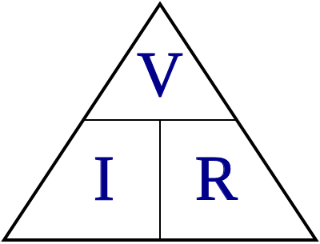

Ohm's Law is a foundational set of relationships between voltage, current and resistance.

It can be expressed as:

`V = I * R`

where

* `V` is voltage (measured in volts)
* `I` is current (measured in [Amperes](AMPERE.md) or "amps")
* `R` is resistance (measured in Ohms)

It can also be expressed as:

`I = V/R`
`R = V/I`

@TODO Example application and expansion

It can be helpful to visualize these relationships:

